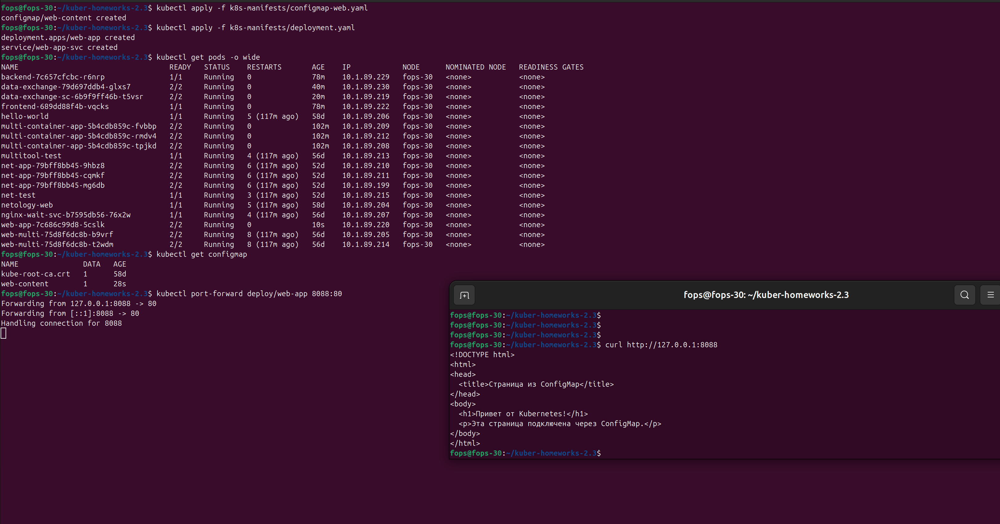
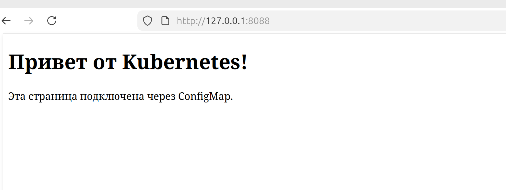
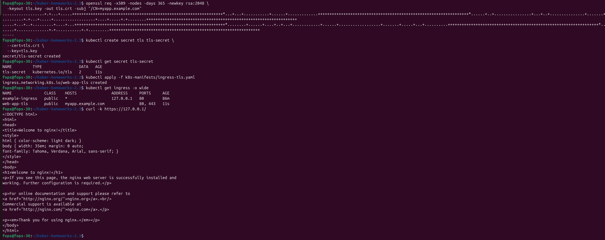
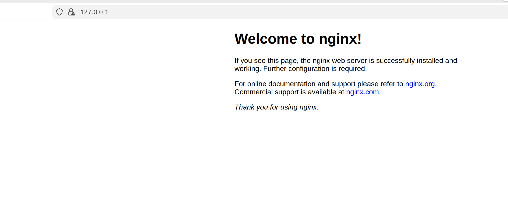
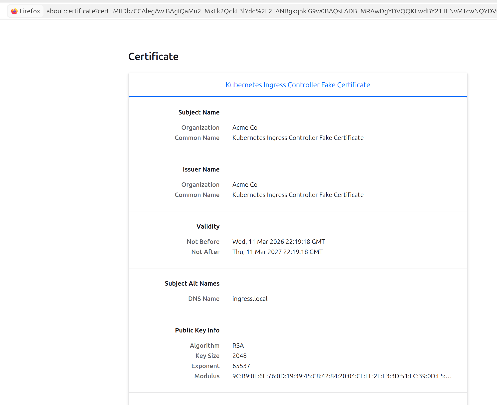
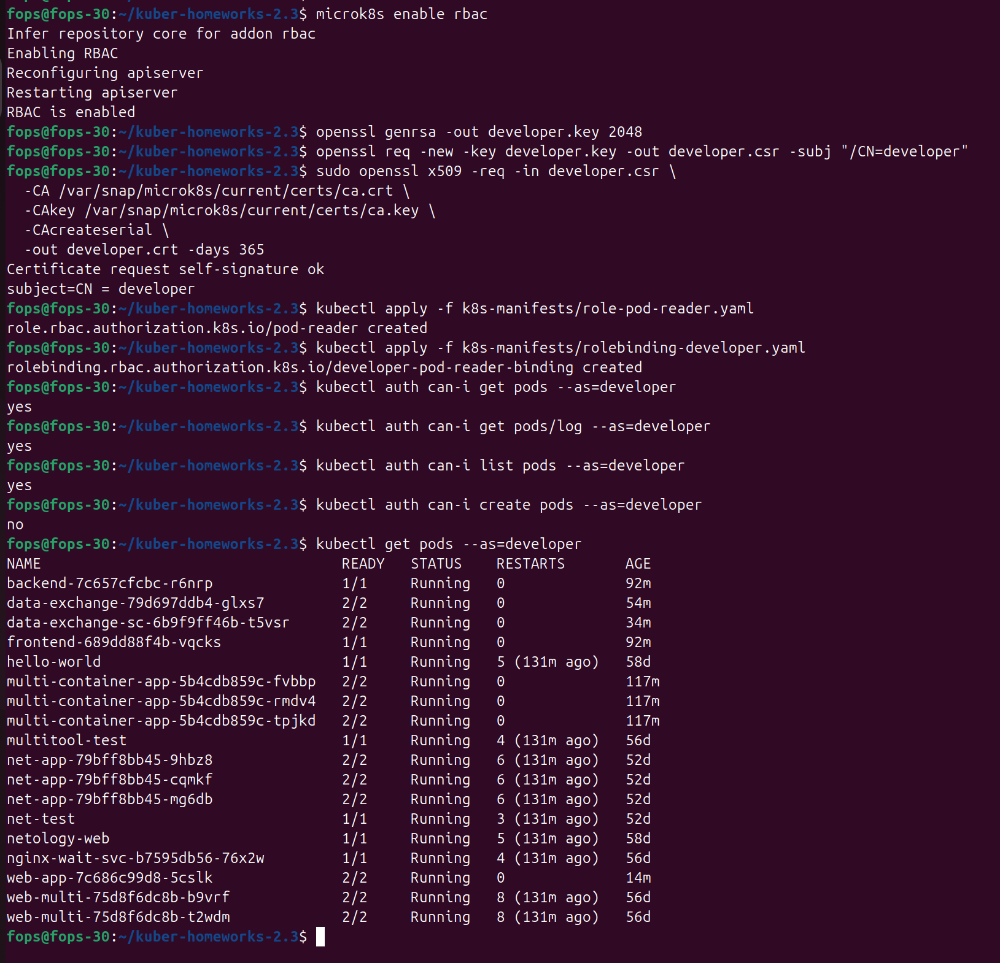

# Домашнее задание: «Настройка приложений и управление доступом в Kubernetes»

## Цель задания
Научиться:
- настраивать конфигурацию приложений с помощью ConfigMap и Secret;
- управлять доступом пользователей через RBAC.

---

## Используемое окружение
- Kubernetes: MicroK8S
- ОС: Ubuntu 24.04 (VM)
- kubectl: установлен и настроен
- openssl: установлен

---

# Задание 1. Работа с ConfigMap

## Манифесты
- `k8s-manifests/deployment.yaml`
- `k8s-manifests/configmap-web.yaml`

## Дополнительная диаграмма
- `diagrams/cm_secret.puml`

## Применение манифестов

```bash
kubectl apply -f k8s-manifests/configmap-web.yaml
kubectl apply -f k8s-manifests/deployment.yaml
```

## Проверка ресурсов

```bash
kubectl get pods -o wide
kubectl get configmap
```

## Проверка доступности веб-страницы

```bash
kubectl port-forward deploy/web-app 8088:80
curl http://127.0.0.1:8088
```

Скриншот результата:




---

# Задание 2. Настройка HTTPS с Secrets

## Команды генерации сертификатов

```bash
openssl req -x509 -nodes -days 365 -newkey rsa:2048 \
  -keyout tls.key -out tls.crt -subj "/CN=myapp.example.com"
```

## Создание TLS Secret

```bash
kubectl create secret tls tls-secret \
  --cert=tls.crt \
  --key=tls.key
```

## Проверка Secret

```bash
kubectl get secret tls-secret
```

## Манифест
- `k8s-manifests/ingress-tls.yaml`

## Применение манифеста Ingress

```bash
kubectl apply -f k8s-manifests/ingress-tls.yaml
kubectl get ingress -o wide
```

## Проверка HTTPS-доступа

```bash
curl -k https://127.0.0.1/
```

Скриншот результата:





---

# Задание 3. Настройка RBAC

## Включение RBAC

```bash
microk8s enable rbac
```

## Команды генерации сертификатов пользователя

```bash
openssl genrsa -out developer.key 2048
openssl req -new -key developer.key -out developer.csr -subj "/CN=developer"
sudo openssl x509 -req -in developer.csr \
  -CA /var/snap/microk8s/current/certs/ca.crt \
  -CAkey /var/snap/microk8s/current/certs/ca.key \
  -CAcreateserial \
  -out developer.crt -days 365
```

## Манифесты
- `k8s-manifests/role-pod-reader.yaml`
- `k8s-manifests/rolebinding-developer.yaml`

## Применение манифестов

```bash
kubectl apply -f k8s-manifests/role-pod-reader.yaml
kubectl apply -f k8s-manifests/rolebinding-developer.yaml
```

## Проверка прав

```bash
kubectl auth can-i get pods --as=developer
kubectl auth can-i get pods/log --as=developer
kubectl auth can-i list pods --as=developer
kubectl auth can-i create pods --as=developer
kubectl get pods --as=developer
```

Скриншот результата:



---

## Дополнительные материалы
Для наглядности в репозиторий добавлена диаграмма взаимодействия Pod, ConfigMap и Secret:
- `diagrams/cm_secret.puml`

---

# Итог

В ходе выполнения работы были освоены:
- использование ConfigMap для подключения конфигурации и веб-страницы;
- использование TLS Secret для HTTPS-доступа;
- настройка RBAC для пользователя с ограниченными правами.

